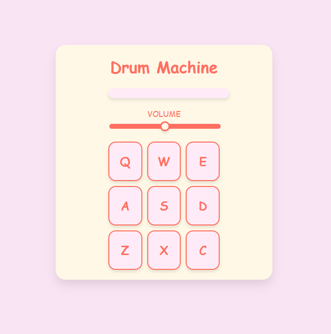

# 🥁 Drum Machine

🎧 A fun and responsive **Drum Machine** built with **React**! Trigger sounds with your keyboard or by clicking on drum pads, and control the volume with a slider. Perfect for practicing rhythm or just making some noise! 🔊💥

---

## 🎹 Features

- 💡 Press keys (Q, W, E, A, S, D, Z, X, C) or click on pads to trigger sounds
- 🔈 Adjustable volume control via slider
- 🖥️ Real-time display of the current sound name
- 🎧 Audio playback using HTML5 `<audio>` elements
- ⚛️ Built entirely with **React** (Hooks-based)

---

## 📸 Preview



---

## 🧠 Technologies Used

- React (`useState`, `useEffect`)
- JavaScript ES6+
- HTML5 Audio API
- CSS3 (responsive layout)

---

## 🚀 Getting Started

1. **Clone the repo**
   ```bash
   git clone https://github.com/AdesKitty01/drum-machine.git
   cd drum-machine
